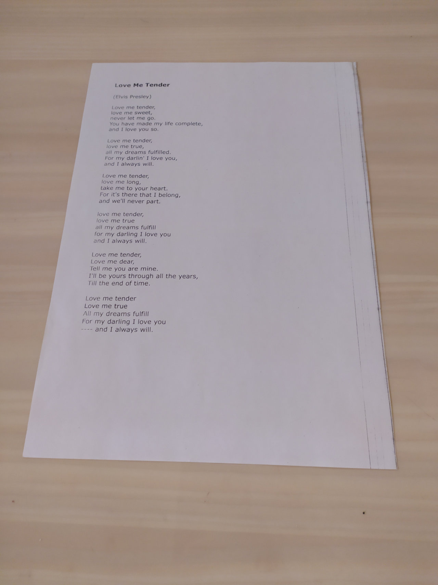
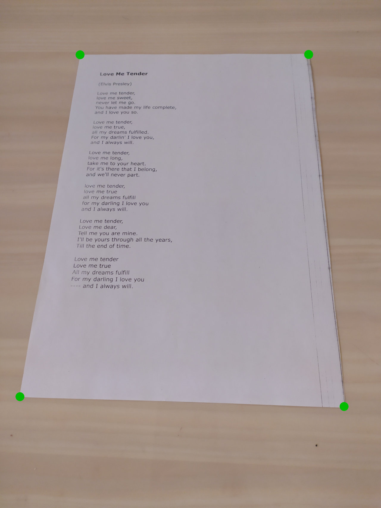
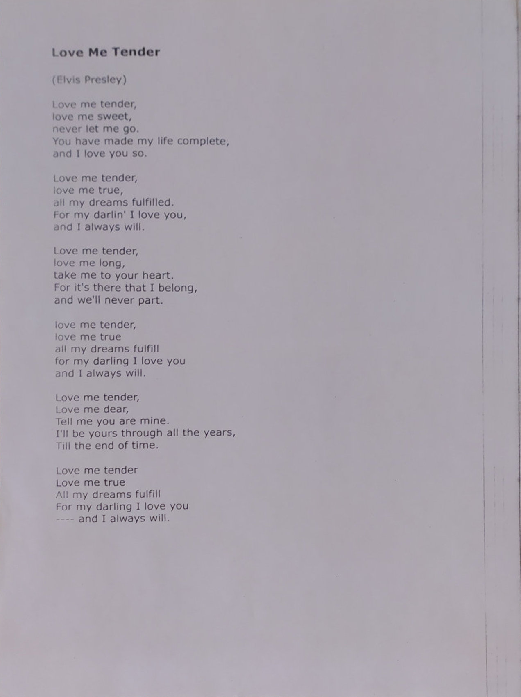

# opencv-test-app
Тестовое задание opencv.

## Задача
Разработать приложение для нахождения самого большого прямоугольного документа на его фотографии (изображении), выполнить преобразование его перспективы. 
Пример:

  

## Требования
* Язык программирования: C++ или Python,
* Необходимо использовать преимущественно библиотеку opencv,
* Входное изображение может быть в форматах JPEG или PNG
* Результатом должно быть консольное приложение, передача имени файла через параметры коммандной строки
